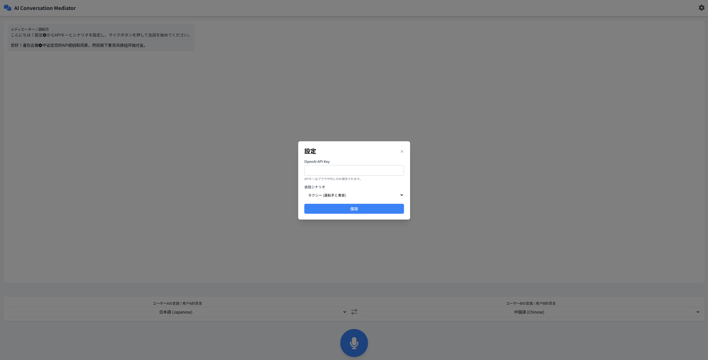
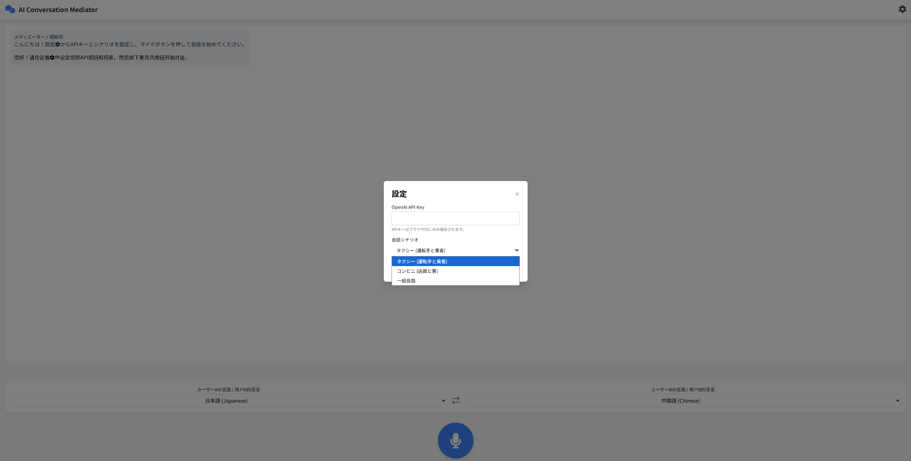
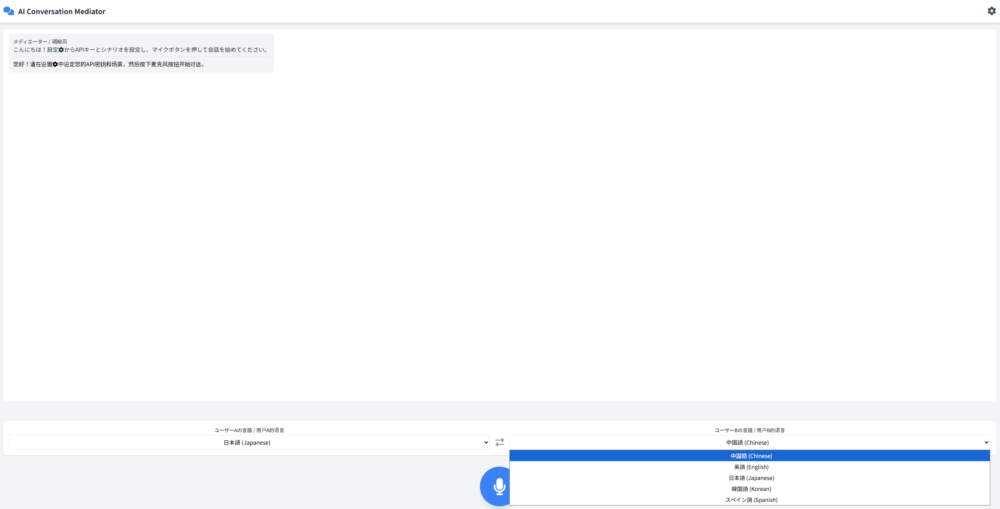
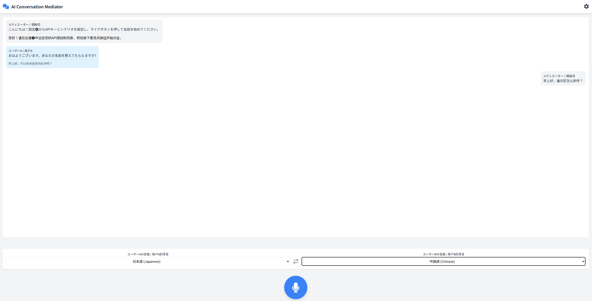

## AI Conversation Mediator アプリケーションのご説明

このアプリケーションは、異なる言語を話す二人の間のコミュニケーションを、単なる翻訳を超えて円滑に仲介することを目的としたWebアプリケーションです。最新のAI技術（OpenAI GPT-4o）を活用し、会話の「仲介者（メディエーター）」として機能します。

---

### 主な特徴

- **インテリジェントな会話仲介**  
	このアプリの最大の特徴は、言葉をそのまま翻訳するだけではない点です。「タクシー」や「コンビニ」といった状況（シナリオ）を選ぶことで、AIが会話の目的を理解します。その上で、相手が最も理解しやすく、次に行動しやすいように、情報を整理・補足して伝えます。

- **話者の自動言語識別**  
	マイクボタンは一つだけです。ユーザーが話す前に話者を選択する必要はありません。マイクボタンを押して話すだけで、AIがその音声がどちらのユーザーの言語（例：日本語か中国語か）であるかを自動で判断します。

- **分かりやすいUI（ユーザーインターフェース）**
		- **バイリンガル表示:** 「ユーザーA」や「メディエーター」といったラベルは、設定された二つの言語で同時に表示されるため、どちらの話者にとっても直感的に操作できます。
		- **会話ログ:** 発言内容は「原文」と「相手の言語への翻訳」が併記されます。これにより、自分の言葉がどう伝わるかを確認でき、安心して会話を進められます。
		- **動的なチャット表示:** AI（メディエーター）からの返答は、内容に応じて表示位置が変わります。相手への伝言であれば相手側に、発言者への確認の質問であれば発言者側に表示され、会話の流れが自然に感じられます。

- **簡単な操作**  
	ユーザーは最初にそれぞれの言語を設定し、APIキーを入力するだけです。あとは中央の大きなマイクボタンを押しながら話すだけで、音声認識からテキスト化、意図の解釈、翻訳、そして自然な音声での応答までが自動的に行われます。

    - トップ画面
    
    - APIキーの設定画面（open ai api)
    
    - 会話シナリオの設定画面
    
    - 会話画面
    

---

### 利用シーンの例

- **タクシーで:**
		- 乗客が「あの大きな提灯があるお寺へ」と曖昧に伝えても、AIが「浅草の雷門ですね」と具体的に補足し、運転手に伝えます。

- **コンビニで:**
		- お客様が商品について質問すると、AIが店員に分かりやすく質問の意図を整理して伝えます。

---

このように、このアプリは言語の壁を取り払うだけでなく、お互いの意図を深く理解し合うことを助ける、強力なコミュニケーションツールです。
このアプリは、Geminiによって生成されました。
Geminiとのチャットログは、以下を参照ください。
https://g.co/gemini/share/b36310ec0248

## 集合写真メーカー アプリケーションのご説明

このアプリケーションは、写真を加工して特別な集合写真を作成するためのツールです。簡単な操作で、イベント名やフレームを追加し、思い出に残る一枚を作成できます。

---

### 主な特徴

- **直感的なUI**  
  ユーザーは写真をアップロードし、スライダーや入力フィールドを使って簡単にカスタマイズできます。

- **フレームとテキストのカスタマイズ**  
  写真にフレームを追加したり、イベント名を入力して写真にテキストを挿入できます。フレームの太さやテキストの位置、サイズも自由に調整可能です。

- **リアルタイムプレビュー**  
  加工内容をリアルタイムでプレビューできるため、完成イメージを確認しながら編集できます。

- **ダウンロード機能**  
  加工した写真をワンクリックでダウンロード可能です。ファイル名はイベント名に基づいて自動生成されます。

---

### 利用シーンの例

- **イベントの記念写真作成:**  
  社内イベントや学校行事の集合写真にイベント名やフレームを追加して、特別な一枚を作成。

- **SNS投稿用の写真加工:**  
  SNSに投稿する写真を簡単に加工して、見栄えを良くする。

- **プレゼント用:**  
  家族や友人へのプレゼントとして、特別な写真を作成。

---

このアプリは、写真加工を簡単に行いたい方に最適なツールです。

## IPA過去問学習アプリ アプリケーションのご説明

このアプリケーションは、IPA（情報処理推進機構）の過去問をPDFファイルを使って効率的に学習するためのWebアプリケーションです。AI技術（OpenAI GPT-4）を活用して、単なる問題・解答の確認を超えた詳細な解説を提供し、理解を深める学習体験を実現します。

---

### 主な特徴

- **PDFファイルによる問題・解答管理**  
  問題PDFと解答PDFをアップロードするだけで、ページごとに問題を自動認識し、学習セッションを開始できます。

- **AIによる詳細解説機能**  
  選択した回答に対して、OpenAI GPT-4が詳細な解説を生成します。正解・不正解に関わらず、なぜその答えになるのか、他の選択肢がなぜ間違いなのかを分かりやすく説明します。

- **学習セッション管理**  
  - **セッション保存・復帰:** 学習途中で中断しても、次回同じところから再開できます
  - **進捗管理:** どの問題を解いたか、正解したかを記録し、学習状況を把握できます
  - **データのインポート/エクスポート:** 学習データをJSONファイルとして保存・共有可能です

- **直感的なUI**  
  - **PDFビューア:** 問題PDFをアプリ内で直接閲覧でき、ページ移動も簡単
  - **選択肢UI:** A、B、C、Dの選択肢を分かりやすく表示
  - **リアルタイム解説:** 回答後すぐにAIによる詳細解説が表示されます

- **ローカルストレージ活用**  
  ブラウザのIndexedDBを使用してデータを保存するため、インターネット接続がない環境でも過去の学習データにアクセスできます。

---

### 利用シーンの例

- **資格試験対策:**  
  基本情報技術者試験や応用情報技術者試験などのIPA試験対策として、過去問を体系的に学習。

- **復習・弱点克服:**  
  AIの詳細解説により、単なる暗記ではなく理解に基づいた学習で、弱点分野を効率的に克服。

- **グループ学習:**  
  学習データのエクスポート機能を使って、チームメンバーと学習進捗や解説を共有。

---

このアプリは、IPA試験対策を効率的に行いたい方や、IT分野の知識を体系的に学習したい方に最適なツールです。

## シンギングボウル 音響シンセサイザー アプリケーションのご説明

このアプリケーションは、チベットのシンギングボウルをデジタルで再現したWebベースの音響シンセサイザーです。倍音を含む複雑な共鳴音を生成し、瞑想、リラクゼーション、サウンドセラピーに最適な環境を提供します。

---

### 主な特徴

- **リアルな音響シミュレーション**  
  シンギングボウルの物理的な響きを再現するため、基音と複数の倍音を含む音響モデルを採用。各倍音は独自の減衰カーブと位相を持ち、自然で深みのある音色を実現します。

- **2つの演奏モード**  
  - **タップモード:** ボウルの中心をタップして叩く音を再生。音は自然に減衰します
  - **ラブモード:** ボウルの縁をなぞるように動かすことで、持続的な歌うような音を生成。動きの速度に応じて音量が変化します

- **高度なパラメータ調整**  
  - **基本周波数 (Frequency):** 50Hz〜600Hzまで調整可能。Om音136Hz、ルートチャクラ194Hz、ソーラープレクサス528Hzなど、伝統的な周波数に対応
  - **パルセーション速度 (Pulsation Speed):** ビート周波数を0.1Hz〜10Hzで調整し、音の揺らぎを制御
  - **ステレオ幅 (Stereo):** 左右チャンネルの広がりを調整し、没入感のある音場を作成
  - **共鳴ゲイン (Resonance Gain):** 音の強度を0〜3倍まで調整可能

- **プリセット機能**  
  - **デフォルトプリセット:** Earth (Om) 136Hz、Deep Sleep (Delta)、Focus (Alpha) 256Hz、Solar Plexus 528Hz、Root Chakra 194Hz
  - **カスタムプリセット保存:** 自分好みの設定を名前を付けて保存し、いつでも呼び出し可能
  - **プリセット管理:** ユーザー作成のプリセットは削除可能で、ブラウザのローカルストレージに永続保存

- **直感的なビジュアルUI**  
  - **リアルタイム視覚フィードバック:** 音のエネルギーに応じてボウルが光り、背景のオーラが脈動
  - **タッチ/マウス対応:** デスクトップでもモバイルでも快適に操作可能
  - **ダークテーマ:** 目に優しく、瞑想やリラクゼーションに適したデザイン

---

### 利用シーンの例

- **瞑想・マインドフルネス:**  
  Om音136Hzやルートチャクラ194Hzなどの周波数で、深い瞑想状態へ導きます。

- **睡眠サポート:**  
  Deep Sleep (Delta)プリセットを使用して、低周波のビート音で脳波をリラックス状態に誘導。

- **集中力向上:**  
  Focus (Alpha) 256Hzプリセットで、集中力を高めるアルファ波帯域の音を生成。

- **サウンドヒーリング:**  
  Solar Plexus 528Hzなど、各チャクラに対応した周波数で、エネルギーバランスを整える。

- **クリエイティブな音楽制作:**  
  パラメータを調整して独自の音色を作成し、アンビエント音楽の素材として活用。

---

このアプリは、伝統的なシンギングボウルの癒しの力をデジタルで体験したい方、サウンドセラピーや瞑想に興味がある方に最適なツールです。